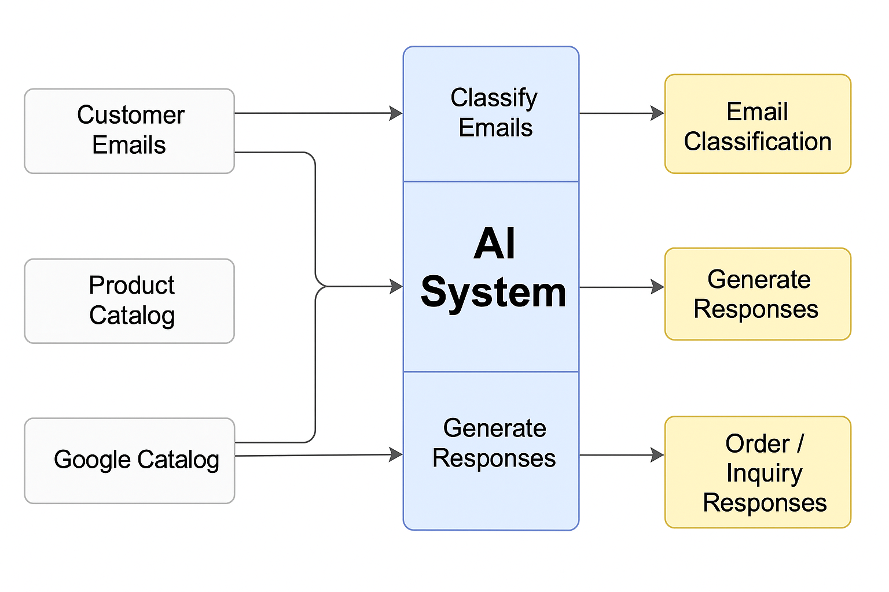

# AI-Driven Email Automation for a Fashion Store

**Tech Stack:** Python (Jupyter Notebook), OpenAI GPT-4o, LangChain, FAISS, Google Sheets API, Google Colab

## 📋 Project Overview

This project automates the classification and handling of customer emails for a fashion retail business. Using GPT-4o and Retrieval-Augmented Generation (RAG), the system:

- Classifies emails as either product inquiries or order requests.
- Extracts product IDs and quantities from order requests.
- Verifies stock availability and updates order statuses accordingly.
- Generates professional customer responses for order confirmations and product inquiries.
- Efficiently handles a large product catalog (up to 100,000+ items) using FAISS vector search.

## 🔑 Key AI Techniques

- ✅ LLM-based Text Classification
- ✅ Information Extraction (product ID + quantity parsing)
- ✅ Retrieval-Augmented Generation (RAG)
- ✅ Embedding & Similarity Search

## 💡 Challenges Solved

- Handling semi-structured real-world customer emails.
- Generating personalized, professional responses at scale.
- Ensuring scalability without exceeding token limits.

---

### 🚀 How It Works

1️⃣ **Email Classification:**  
   Emails are labeled as either `order request` or `product inquiry`.

2️⃣ **Order Processing:**  
   For order requests, the app verifies stock, processes orders, updates stock levels, and logs order statuses.

3️⃣ **Product Inquiry Handling:**  
   Uses RAG to search the product catalog for relevant items and generates context-aware replies.

---

### 📂 Outputs

Results are stored in a Google Sheet with the following tabs:

- `email-classification`
- `order-status`
- `order-response`
- `inquiry-response`

## Screenshot

---

## 📈 Future Improvements

- Add error monitoring and logging.
- Expand multi-language support.
- Integrate directly with live email systems (e.g., Gmail API).
## 📓 Notebook

You can view the full notebook [here](./AI%20Email%20Automation%20Tariq%20Syed%20fashion%20store%20email%20automation.ipynb).

## 🖼️ System Overview

