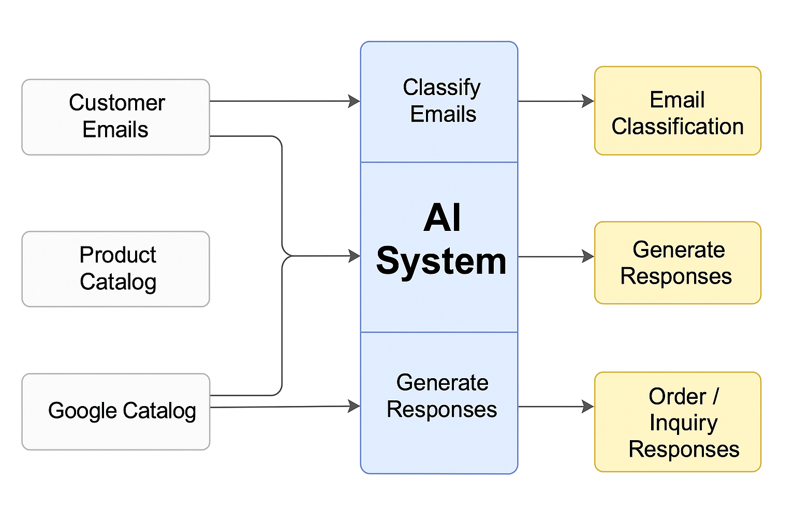

# AI-Driven Email Automation for a Fashion Store

An applied AI automation project for classifying retail customer emails, extracting order details, checking stock, retrieving relevant product information, and drafting customer responses.

## What it demonstrates

- LLM-based email classification
- Structured information extraction
- Retrieval-Augmented Generation (RAG)
- Embeddings and FAISS vector search
- Stock-aware order handling
- Customer-response generation
- Environment-based configuration for external services

## Architecture

```text
Customer email
     |
     v
LLM classification
  /          \
Order        Product inquiry
request            |
  |                v
Extract ID     FAISS retrieval
+ quantity          |
  |                v
Stock check    Product context
  \                /
   \              /
    v            v
   Customer response
```

The original assessment also wrote workflow outputs to Google Sheets. This public portfolio version uses small self-contained sample data so the workflow can be reviewed without external account data.

## Technology

Python, OpenAI API, LangChain, FAISS, Jupyter Notebook and Google Colab.

## Notebook

[Open the portfolio notebook](./AI_Email_Automation_Tariq_Syed.ipynb)

## Run locally

1. Clone the repository.
2. Create and activate a Python virtual environment.
3. Install dependencies with `pip install -r requirements.txt`.
4. Copy `.env.example` to `.env` and configure your local environment.
5. Open `AI_Email_Automation_Tariq_Syed.ipynb` in Jupyter or VS Code and run the cells in order.

## Repository structure

```text
AI_Email_Automation_Tariq_Syed.ipynb   Main portfolio notebook
README.md                               Project documentation
requirements.txt                        Python dependencies
.env.example                            Environment configuration template
.gitignore                              Local files excluded from Git
flow.png                                Workflow diagram
```

## Responsible AI and production considerations

A production implementation should include schema validation, audit logging, retry and error handling, access controls, monitoring, and human review for low-confidence or high-impact decisions.

## Limitations

This is a portfolio demonstration rather than a production email-processing service. The included catalogue and emails are small examples. Live email, inventory and Google Sheets integrations require authenticated external services and additional operational controls.

## Future improvements

- Add automated tests and evaluation datasets
- Add confidence thresholds and human-in-the-loop review
- Integrate a production email provider and inventory API
- Add structured logging and observability
- Add multilingual evaluation

## System overview



## Author

**Tariq Syed** — AI, product and digital transformation practitioner.
